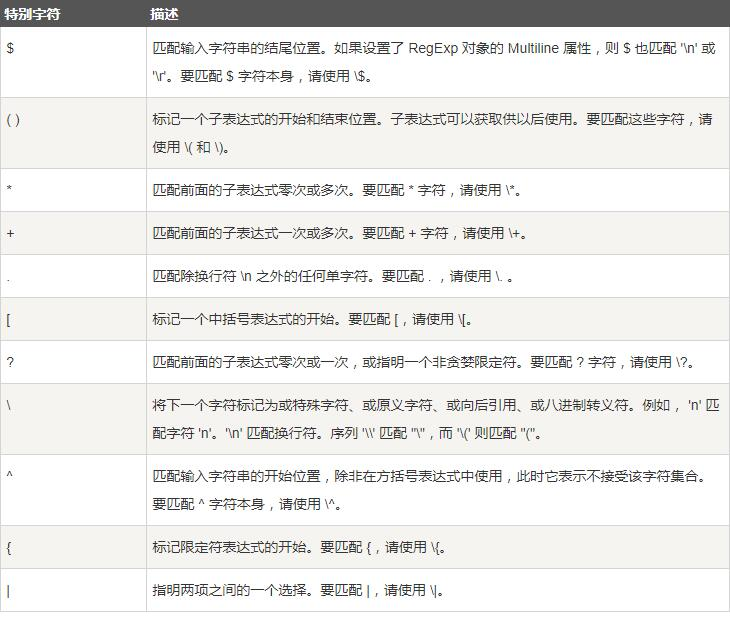

## 算法
1. 刷完剑指Offer
2. 动态规划经典题目
3. 最短路径问题
4. 字符串匹配（前缀后缀树，KMP等）
5. 八大排序算法时间复杂度分析
6. 重点默写快速排序、归并排序、堆排序等
7. 树的5种遍历方式：前中后、深度优先遍历（使用栈）、广度优先遍历（也叫宽度优先遍历，和层次遍历一个意思，使用队列来实现）
8. 最小生成树、最短路径算法

## 数据结构
1. 树（平衡二叉树，2-3树，红黑树，B/B+树）
2. 图的表示（矩阵表示的题目）

## 大型网站结构和Java中间件实践
> 再温习一遍

## 项目温习总结

## 比赛总结

## [Mysql](./MySql.md)
## [Regex-java](../../src/test/java/huawei_8_16/TestT1.java)

#### 1-匹配字符类

###### 方括号一次只能匹配括号内的一个字符
- [abc] 
> a, b, or c (简单类) 
- [^abc] 
> 除了a、b或c之外的任意 字符（求反） 
- [a-zA-Z] 
> a到z或A到Z ，包含（范围) 
- [a-zA-Z0-9]
> 匹配一次所有数字和字母的类型

- [a-z-]
###### 圆括号一次匹配多个字符

1. 比如方括号的正则表达式"t[aeio]n"只匹配"tan"、"Ten"、"tin"和"ton"，只能匹配单个字符,不能匹配"taeion"
2. 圆括号可以一次匹配多个字符，比如使用"t(a|e|i|o|oo)n"正则表达式，可以匹配"taen"，"tan"，"taeiooon"等
也可以配合[]使用，如正则为"t([aei]|o|oo)n"，则可以匹配 "taon"，"teoon"，但是不能匹配"taeioon"

#### 2-预定义字符类

- . 匹配除换行符 \n 之外的任何单字符
> 比如：表达式就是“t.n”，它匹配“tan”、“ten”、“tin”和“ton”，还匹配“t#n”、“tpn”甚至“t n”。

- \d 数字: [0-9] 
- \D 非数字: [^0-9] 
- \s 空格符: [ \t\n\x0B\f\r] 
- \S 非空格符: [^\s] 
- \w 单词字符: [a-zA-Z_0-9] 
- \W 非单词字符: [^\w]

记忆规则 大写表示取反，小写如下记忆
> d:digit(数字)
s:space(空白字符)
w:word(单词字符), 注意包括下划线

#### 3-表达式匹配次数

\* 0次或者多次（允许0次的贪婪匹配）
> 例如，zo* 能匹配 "z" 以及 "zoo"。* 等价于{0,}

\+ 1次或者多次（贪婪匹配）
> 例如，'zo+' 能匹配 "zo" 以及 "zoo"，但不能匹配 "z"。+ 等价于 {1,}。

? 0次或者1次 （非贪婪匹配，允许0次）
> 例如，"do(es)?" 可以匹配 "do" 或 "does" 。? 等价于 {0,1}。

{n} 恰好n次
{n,m} 从n次到m次
{n,} 至少n次

注意上述n为非负数

#### 4-特殊字符需要转义 

